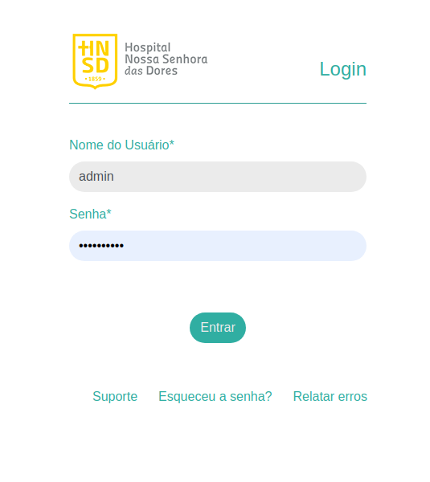
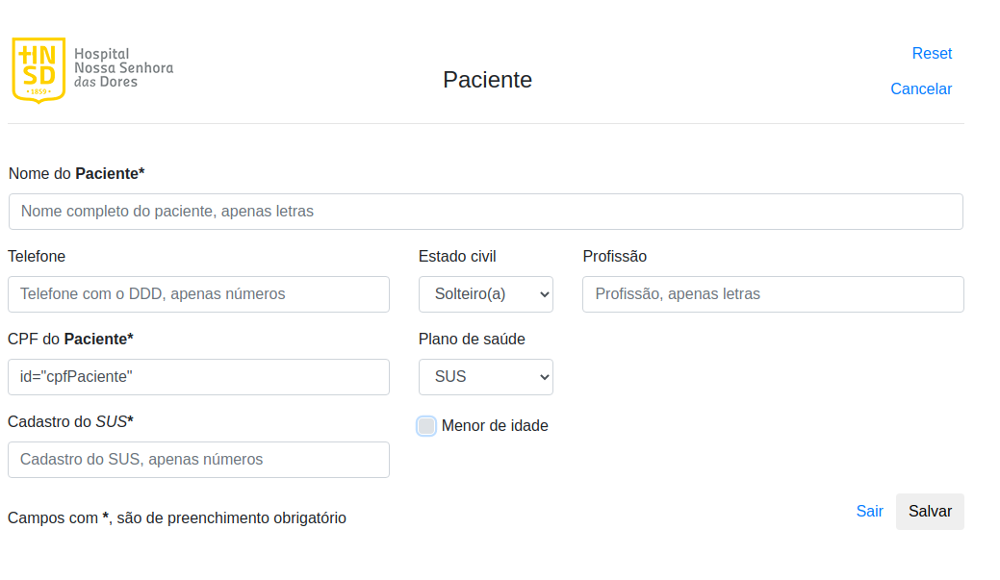
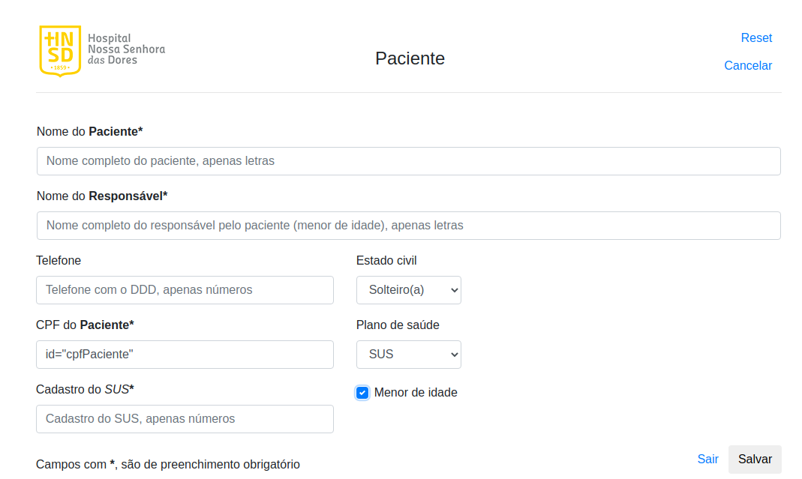
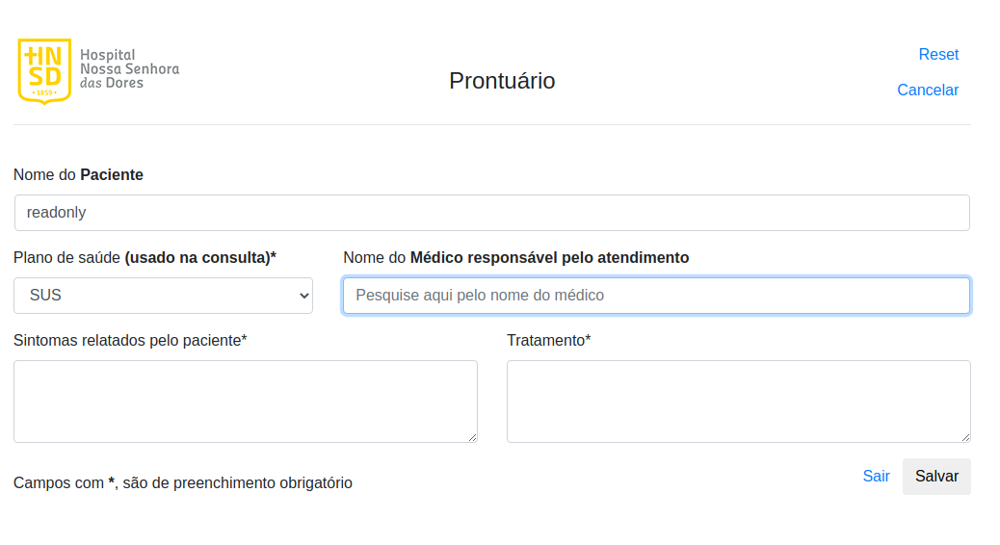
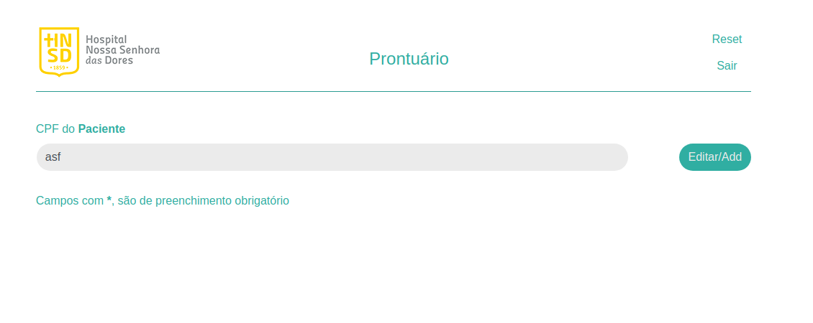

# Hospital

> This project was idealized in Database classes. This work should be an system of an hospital in Itabira,MG-BR city, however, there was problems with that (most of them, related to public services etc) and then, it was discontinued.

-----

### Overview

1. Login
   
   

2. Pacient register
   
   

3. Pacient register 
   
   

4. Medical record
   
   

5. Search
   
   

---

### Dependencies

```bash
sudo apt install php libapache2-mod-php
sudo systemctl restart apache2


# To run, put code into
/var/www/html
```

### Database setup

```bash
docker run \
    -d \
    --name hnsdMysql \
    --restart=always \
    -p 5432:5432 \
    -e POSTGRES_USER=postgres \
    -e POSTGRES_DB=mayan \
    -e POSTGRES_PASSWORD=postgres \
    postgres:9.6

# The database was lost.
```

### Bugs conhecidos:

* Estourando cpf,
* Não faz validação do cpf,

-----

### To Do:

* Modificar cpf para  ***VARCHAR***,
* Fazer validação de cpf,
* **Obter os erros caso não consiga realizar a query no banco, e exibí-los**,
* Transformar campo de médico numa seleção de acordo com a tabela a ser criada (médico),
* Transformar campo de plano numa seleção de acordo com a tabela planos,
* Criar páginas para inserção de usuários, planos, médicos ao sistema,
* Fazer documentação do sistema,
* **Atribuir id de quem cadastrou o paciente e o prontuario**
* ***Datable***
* **Pasta static (como publico)/Caminho absoluto,
* Cookie**

-----

-----

#### Observações:

* [Sistema sem integração com php (apenas design)](https://github.com/ppcamp/Hospital/tree/master/html/modelo/hospital)
* [Imagens do modelo do sistema (design)](https://github.com/ppcamp/Hospital/tree/master/html/modelo)
* [Query do banco](https://github.com/ppcamp/Hospital/blob/master/html/modelo/db.sql)
* [Querys do Thales](https://github.com/ppcamp/Hospital/tree/master/html/modelo/SQL_CREATE_INSERT_PJHospital)
